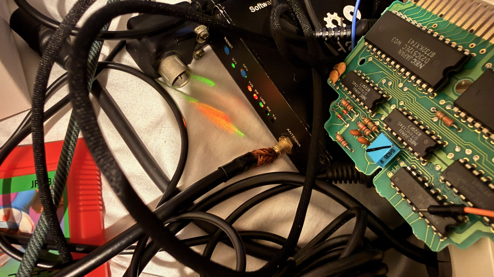

# famicom-rf-hackrf-decoder

[日本語 README はこちら](README.ja.md)

A software decoder that receives the Famicom's VHF RF output (NTSC-J) with a
HackRF One and displays it on your PC in real time — full NTSC color decoding
plus FM intercarrier audio. C++20 + libhackrf + SDL2. No GNU Radio required.

Live decode of a real Famicom (Super Mario Bros.):


Synthetic color-bar golden test output:


## Fork provenance and Juku scope

This repository is the [`ddanila/famicom-rf-hackrf-decoder`](https://github.com/ddanila/famicom-rf-hackrf-decoder)
fork of [`GOROman/famicom-rf-hackrf-decoder`](https://github.com/GOROman/famicom-rf-hackrf-decoder).
The recorded fork point is commit
[`6cce72d4a0e35ed364d086470191d61e3f6cd116`](https://github.com/GOROman/famicom-rf-hackrf-decoder/commit/6cce72d4a0e35ed364d086470191d61e3f6cd116);
fork and upstream `main` were byte-aligned there before Juku work began.

The companion [`8080-cosim`](https://github.com/ddanila/8080-cosim)
repository owns Juku historical evidence, board timing, analog component
values, X7 waveform fixtures, and acceptance results. This decoder owns only
generic sample ingestion, receiver DSP, synchronization, and display code.
Do not introduce guessed Juku timing constants here: every future Juku profile
must link its initial bounds to evidence in `8080-cosim` and must still report
the timing measured from input samples.

The test-only `generate-juku-synthetic` fixture is pinned to `8080-cosim`
commit `eb4d6ab6777db3f97306c9111e9c723c97dcf750`: exact ROM-programmed PIT
counts establish 64 us lines, 313-line frames, 24 us/72-line blanking,
8 us/25-line front porches, and 320x241 active geometry; its guarded D56 model
supplies 5.04 us/223 us sync pulses. This ideal five-bar fixture is deliberately
not a built-in receiver preset and does not claim physical D34_SIG, VT2, load
impedance, or X7 voltage.

## Supported channels

| Channel | Video carrier | Audio carrier (FM) |
|---|---|---|
| Japan VHF ch1 | 91.25 MHz | 95.75 MHz |
| Japan VHF ch2 | 97.25 MHz | 101.75 MHz |

The HackRF tunes 2.0 MHz above the video carrier to keep its DC spike out of
the signal (ch1 → 93.25 MHz) and shifts back down in software.

> **Note: real RF modulators drift.** The unit this was developed against
> outputs its ch1 video carrier at 90.83 MHz (420 kHz below nominal). If you
> can't get sync, run `--spectrum` first to find the actual carrier and pass
> it with `--freq`. Envelope detection tolerates a residual offset of
> ±100 kHz or so.

## Hardware: HackRF One

[HackRF One](https://greatscottgadgets.com/hackrf/one/) (Great Scott
Gadgets) is an open-source SDR covering 1 MHz–6 GHz with 8-bit IQ sampling
up to 20 MSPS over USB 2.0. This project uses it receive-only at 10 MSPS.



Connection: Famicom RF output (75 Ω RCA, the cable that normally goes to
the TV's antenna terminal) into the HackRF's **ANTENNA** SMA port. A proper
RCA→SMA adapter is nicer, but as the photo shows, simply joining the
coax center conductor to the SMA pin works fine — the modulator output is
strong, so cable losses are a non-issue. Keep the connection wired
(no over-the-air radiation) and start with AMP off / moderate LNA gain;
watch the clip warning and adjust with `l`/`g` keys.

The LEDs on the board: 3V3/1V8/RF = power rails, USB = host connected,
RX flashes while famidec is streaming.

## Build

```sh
brew install hackrf sdl2 cmake pkg-config   # macOS; Linux needs the same libs
cmake -B build -DCMAKE_BUILD_TYPE=Release
cmake --build build -j
```

Developed and tested on macOS (Apple Silicon); the code has no
platform-specific dependencies beyond libhackrf and SDL2.

## Usage

```sh
# 1. Check the spectrum first (find the real carrier position)
./build/famidec --channel 1 --spectrum

# 2. Live display (channel preset, or the measured frequency)
./build/famidec --channel 1
./build/famidec --freq 90.83e6

# Record raw IQ while decoding
./build/famidec --freq 90.83e6 --record cap.cs8

# Decode from a recording (hackrf_transfer .cs8 files work too)
./build/famidec --input file --file cap.cs8 --loop

# Headless: dump decoded frames as PPM (debug / verification)
./build/famidec --input file --file cap.cs8 --dump-frames out_ --frames 30

# Decode an already-detected composite waveform (sample rate is mandatory)
./build/famidec --input baseband-f32 --file composite.f32 --rate 10e6 \
  --mode gray --dump-frames out_ --frames 1
```

`baseband-f32` consumes a headerless stream of little-endian IEEE-754 float32
samples, one detected-composite sample per time step. It bypasses all RF/IQ
DC blocking, tuning, channel filtering, AM/FM detection, spectrum, and IQ
recording stages. The raw convention is negative modulation: sync is higher
than blanking. Files must be nonempty, exactly divisible into four-byte
samples, and contain no NaN or infinity.

The default `--agc auto` estimates sync and blanking. For a known waveform,
`--agc fixed --sync-level S --blank-level B` uses post-transform levels and
requires `S > B`. Input transforms are applied in this order: optional
polarity inversion, `--baseband-gain`, then `--baseband-offset`.

Custom monochrome timing is explicit and intentionally has no built-in Juku
preset. `--timing custom` is accepted only with `baseband-f32 --mode gray` and
requires every timing field shown by `--help`; inconsistent pulse, porch,
active-window, or frame bounds are rejected. For example, the independent
non-NTSC regression uses 8 MS/s, 12.5 kHz lines, and 200-line frames:

```sh
./build/famidec --input baseband-f32 --file custom.f32 --rate 8e6 --mode gray \
  --agc fixed --sync-level 1 --blank-level 0.75 --timing custom \
  --line-rate 12500 --hsync-min-us 5 --hsync-max-us 7 --hsync-scan-us 8 \
  --acquisition-skip-us 40 --tracking-window-us 3 \
  --vsync-fraction 0.6 --vsync-min-lines 3 --lines-per-frame 200 \
  --active-start-line 10 --active-lines 180 \
  --active-start-us 12 --active-width-us 60 \
  --agc-porch-start-us 8 --agc-porch-end-us 10 \
  --dump-frames out_ --frames 1 --stats-json lock.json
```

The JSON report records independent horizontal and frame-lock states, measured
line/frame rates, sync width, blanking level, video range, decoded/coasted
line counts, and frame count. A custom headless decode returns failure unless
it achieves broad-pulse frame lock; flywheel output is not reported as a
successful capture.

### Options

| Option | Description |
|---|---|
| `--channel 1\|2` | Japan VHF channel preset (default 1) |
| `--freq HZ` | explicit video carrier frequency |
| `--input hackrf\|file\|baseband-f32` | input source (default hackrf) |
| `--file PATH` / `--loop` | .cs8 IQ or little-endian f32 baseband playback / loop |
| `--rate HZ` / `--offset HZ` | sample rate (default 10e6) / tuning offset (default 2e6) |
| `--lna N` / `--vga N` / `--amp` | LNA 0-40 (default 24) / VGA 0-62 (default 20) / RF amp |
| `--mode color\|gray` | color / grayscale (default color) |
| `--detector envelope\|sync` | envelope / carrier-PLL synchronous detection |
| `--sat F` / `--hue DEG` | saturation / hue trim |
| `--overscan F` | horizontal crop per side, 0..0.15 (default 0.047 ~ the NES 256-px picture) |
| `--fm-freq HZ` | FM radio station for the `f` key (default 80.0e6) |
| `--no-audio` / `--volume F` | disable FM audio / volume 0..1 (default 0.7) |
| `--record PATH` | tee raw IQ to .cs8 while decoding |
| `--dump-frames PREFIX` / `--frames N` | headless PPM frame dump |
| `--dump-composite PATH` | dump post-AGC composite as f32 (debug) |
| `--baseband-polarity normal\|inverted` | baseband polarity before gain/offset |
| `--baseband-gain F` / `--baseband-offset F` | baseband affine transform (defaults 1 / 0) |
| `--agc auto\|fixed` | baseband level estimation (default auto) |
| `--sync-level F` / `--blank-level F` | fixed post-transform levels; sync must be greater |
| `--timing ntsc\|custom` | default NTSC policy or fully explicit custom monochrome timing |
| `--line-rate` / `--hsync-*-us` / `--vsync-*` | custom acquisition and synchronization bounds |
| `--lines-per-frame` / `--active-*` / `--agc-porch-*-us` | custom frame, active-window, and blank-measurement bounds |
| `--stats-json PATH` | measured lock, rate, sync, blank, and video-range report |
| `--spectrum` | print PSD and exit (no video) |

### Keys / on-screen display

- `q` / ESC: quit, `l` / `L`: LNA ±8 dB, `g` / `G`: VGA ±2 dB,
  `c`: color/gray toggle, `s`: screenshot (BMP), `h`: help overlay
- `v`: start/stop IQ recording to `famidec_rec_NNN.cs8` (a red `REC`
  counter shows while recording); replay later with
  `famidec --input file --file famidec_rec_001.cs8 --loop`.
  Raw IQ at 10 MSPS is ~20 MB/s (~72 GB/hour) — record short clips
- `←` / `→`: tune ±50 kHz, `↑` / `↓`: tune ±1 MHz (live retuning)
- `r`: CRT emulation (barrel distortion + scanlines + vignette)
- `o`: toggle the top-right HUD
- `f`: broadcast FM radio mode — retunes to `--fm-freq` (default 80.0 MHz
  TOKYO FM) and demodulates wideband FM (±75 kHz, 50 µs de-emphasis);
  arrows tune in 100 kHz / 1 MHz steps; press `f` again to return to TV.
  Reception depends on your antenna — the Famicom RF cable is a poor one
- **Top left (big green)**: retro-TV style channel number (`CH1`)
- **Top right (yellow)**: sync lock states and decoded FPS
  (`V-SYNC:OK H-SYNC:OK 60.0FPS`), video/audio carriers
  (`VHF:90.83MHz AUD:95.33MHz`), and measured latency
  (`DELAY V:35ms A:88ms`)
- While unlocked the display free-runs and shows **snow**, like a real TV;
  when the vsync pulses are lost in noise, frames keep flowing on the
  line-PLL flywheel

## How it works

```
HackRF One (10 MSPS, tuned video carrier +2 MHz)
  → complex DC blocker (removes the tuner DC spike)
  → NCO mixer shifts the video carrier to 0 Hz
  → 4.3 MHz complex LPF (rejects FM audio & adjacent channel)
  → AM detection (envelope, or carrier-PLL synchronous)
  → AGC (sync-tip / back-porch tracking → IRE normalization)
  → sync separation + flywheel line PLL / vsync detection
  → Y/C band split (3.58 MHz BPF, Y = composite − chroma)
  → per-line color burst phase measurement → chroma QAM demod (U/V)
  → YUV→RGB, 640×480 (240p line-doubled)
  → triple buffer → SDL2 display
audio tap (pre-LPF) → −4.5 MHz mix → ÷25 decimating FIR (400 kHz)
  → FM discriminator → 75 µs de-emphasis → ÷8 → 50 kHz → SDL audio

little-endian f32 detected composite
  → polarity / gain / offset → AGC (auto or fixed)
  → NTSC color path above, or profile-driven sync → direct monochrome RGB
```

The Famicom is not broadcast-compliant (non-interlaced 240p, chroma phase
advancing 120° per line, one short line per frame), so the decoder:

- splits Y/C by **frequency band**, not a line comb
- detects vsync as a **long-pulse region** without requiring equalizing pulses
- measures the color burst **independently on every line** instead of
  relying on a burst PLL

Threads: USB callback (push-only into an SPSC ring) → DSP thread
(demod → frame assembly) → main thread (SDL render). Measured ~13× real-time
headroom at 10 MSPS on Apple Silicon.

## Tests

```sh
./build/synth_ntsc            # synthesize color bars → decode → assert RGB
./build/synth_ntsc bars.cs8   # write synthetic IQ as .cs8 (for E2E tests)
./build/baseband_source_test  # validate f32 format, transforms, loop, failures
ctest --test-dir build
```

Linux CI installs the HackRF and SDL2 development libraries, builds the full
RF/IQ application and every test target, runs CTest, and invokes the synthetic
NTSC regression directly. The `baseband_e2e` CTest generates a temporary
six-field grayscale waveform independently of the decoder, invokes the real
CLI, validates five exact output bars, checks invalid CLI combinations, and
removes the generated f32/PPM files after success. A second 12.5 kHz/200-line
fixture proves the explicit non-NTSC profile and measured JSON telemetry. Five
negative waveforms separately prove horizontal or frame-lock failure for
reversed polarity, missing hsync, malformed vsync, clipped sync, and excessive
period error. A third ideal fixture exercises the evidence-linked synthetic
Juku raster at 15.625 kHz and 313 lines while remaining explicitly distinct
from a physical X7 waveform. The monochrome path does not run the NTSC chroma
filters.

### Deterministic fixture policy

- Prefer fixtures generated during the test from small, reviewable timing and
  level parameters. Keep the generator independent of the decoder under test.
- A committed binary fixture must be short and deterministic, with sample
  format, endianness, sample rate, scale/offset, source repository and commit,
  generating command, classification, load impedance when electrical, and a
  SHA-256 digest recorded beside it.
- Receiver tests consume raw samples only. Row, column, sync, active-window,
  and framebuffer truth may be independent test oracles, but must never be
  hidden metadata inputs to the decoder.
- Do not commit long RF captures or multi-gigabyte sample files. Preserve a
  generation recipe or a short redistributable excerpt; for restricted
  physical captures, preserve hashes and derived measurements instead.

## Troubleshooting

| Symptom | Fix |
|---|---|
| Snow, never syncs | run `--spectrum`, find the real carrier, pass `--freq` |
| Too dark / blown out | adjust gain with `l`/`L` `g`/`G` (watch for clipping) |
| No color (grayscale) | burst indicator stays yellow → improve signal/gain/frequency |
| Wrong hues | trim with `--hue DEG` (e.g. `--hue 10`) |
| Picture shifted vertically | tune `kActiveStartLine` in `src/dsp/ntsc_decoder.hpp` |
| No sound | check `--volume`, or the RF modulator's audio carrier may be off-frequency |

## License / disclaimer

MIT License — see [LICENSE](LICENSE).

Receive-only tool. It never transmits with the HackRF One.
